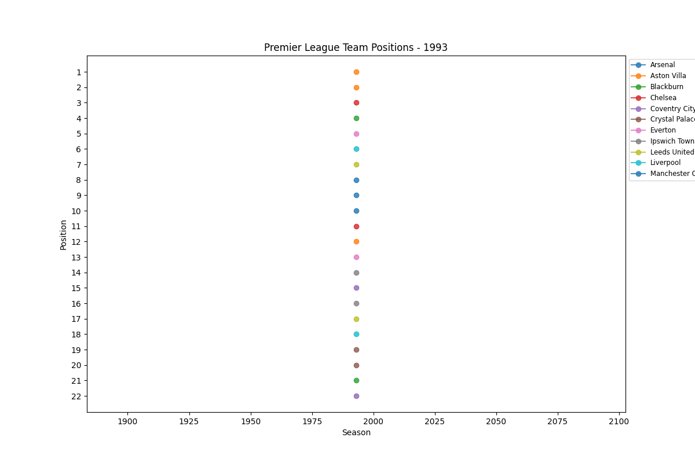
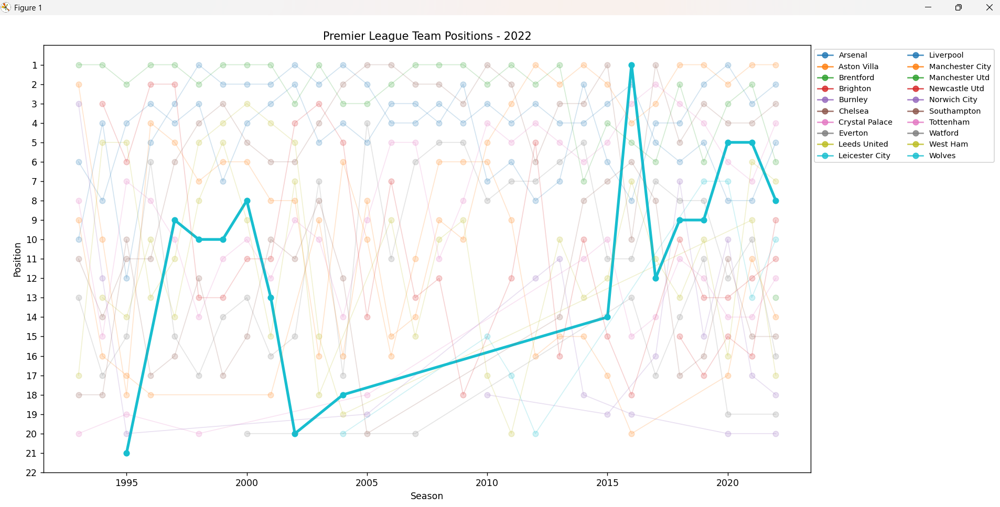

# Premier League Data Visualization

## Introduction
This project visualizes the positions of English Premier League teams from 1993 to 2022 using an animated chart in python. The visualization allows users to track team rankings over the years, with an interactive feature that highlights a specific team's progression when clicked.

## Dataset Information
- **Source**: [Kaggle - English Premier League Standings](https://www.kaggle.com/datasets/evangower/english-premier-league-standings)
- **Years Covered**: 1993-2022
- **Columns Used**:
  - `season_end_year`: The football season (e.g., 1993, 1994, ... 2022)
  - `team`: The name of the football club
  - `position`: The final league standing of the club in that season

## Python Libraries Used
- **NumPy**: For numerical operations
- **Pandas**: For data manipulation
- **Matplotlib**: For data visualization
- **Matplotlib.animation**: To create the animated chart

## Data Visualization Techniques
- **Line Chart**: Plots team positions over time with markers for each season
- **Animated Chart**: Displays rankings dynamically over the years
- **Interactive Highlighting**: Clicking on a team highlights its chart while fading others
- **Y-Axis Intervals**: Set from 1 to 22 for better readability

## Output
- **Animated Graph** (`premier_league_positions.gif`):
  - Displays team standings season by season

- **Interactive using Matplotlib’s `pick_event`**
    - Hover over single teams chart to highlight its progress over the years

## Conclusion
This project provides a visual representation of Premier League teams' performance over three decades. The interactive feature enhances user experience by allowing focused analysis on specific teams. The animation gives a dynamic perspective on club rankings, making it easier to identify trends and dominance over time.

